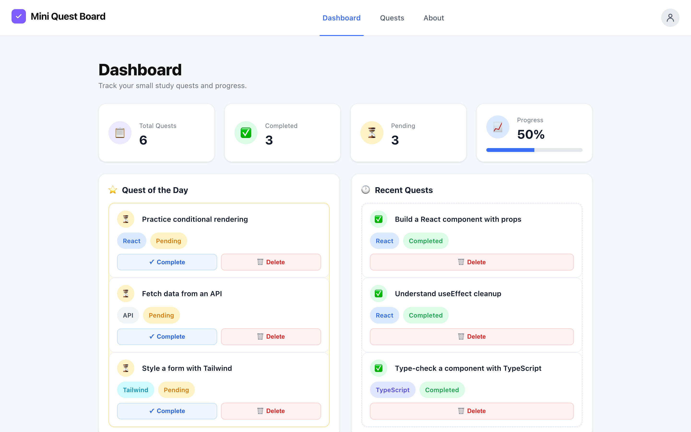
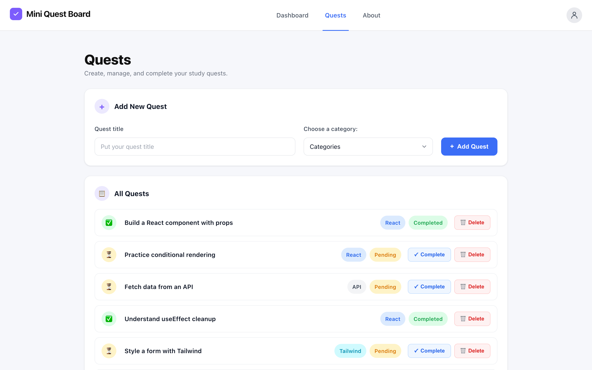
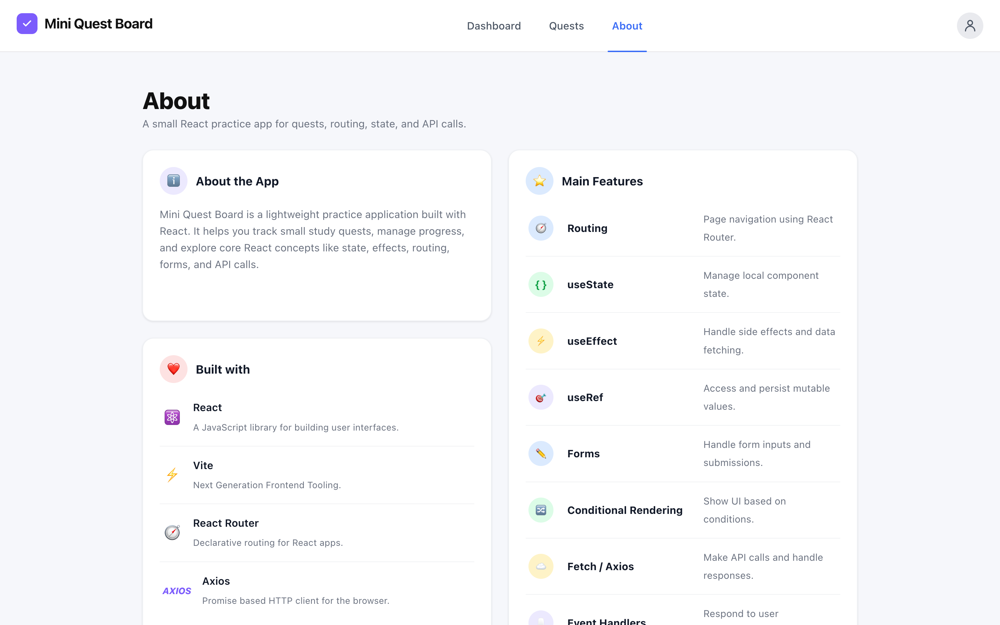

# 🗂️ Mini Quest Board

A small full-stack app for tracking study quests — built as a hands-on practice project for core React concepts (state, effects, refs, routing, conditional rendering, forms) wired up to a real REST API backend.


## Table of Contents

- [Overview](#overview)
- [Screenshots](#screenshots)
- [Features](#features)
- [Tech Stack](#tech-stack)
- [Project Structure](#project-structure)
- [Getting Started](#getting-started)
- [API Reference](#api-reference)
- [What This Project Practices](#what-this-project-practices)

## Overview

Mini Quest Board lets you create study "quests" (small tasks), tag them with a category, mark them complete, and delete them — all persisted through a lightweight Express API. The frontend is a single-page React app with three routes: a **Dashboard** with live stats and highlights, a **Quests** page for full CRUD management, and an **About** page describing the stack.

## Screenshots

### Dashboard

Live stats, a "Quest of the Day" pending-quests highlight, and a scrollable feed of recently completed quests.



### Quests

Create new quests and manage the full list — mark complete or delete, with instant feedback.



### About

A short breakdown of the stack and the React concepts the project was built to practice.



## Features

- 📋 **Dashboard** — total/completed/pending counters, a live progress bar, a "Quest of the Day" panel showing pending quests, and a "Recent Quests" feed of completed ones
- ➕ **Add quests** — title + category form, backed by a real `POST` request
- ✅ **Complete / 🗑️ Delete** — updates persist to the backend and refresh the UI automatically
- 🧭 **Client-side routing** — Dashboard / Quests / About via React Router, with an active-link indicator in the header
- 🎯 **Scroll-to-new-quest** — after adding a quest, the page smoothly scrolls to it using a `ref` shared through the component tree
- 📱 **Responsive layout** — CSS Grid + container queries, so cards adapt to the space they actually have rather than just the viewport width
- 🌐 **REST API backend** — a small Express server with file-based JSON storage, built specifically to practice real HTTP requests instead of mocked data

## Tech Stack

**Frontend**
- [React 19](https://react.dev/) + [Vite](https://vite.dev/)
- [React Router](https://reactrouter.com/) for client-side routing
- [Axios](https://axios-http.com/) for HTTP requests
- Plain CSS per component (Grid, Flexbox, container queries — no framework)

**Backend**
- [Node.js](https://nodejs.org/) + [Express](https://expressjs.com/)
- [CORS](https://www.npmjs.com/package/cors) middleware
- JSON file storage (`backend/data/quests.json`) — no database required
- [nodemon](https://nodemon.io/) for auto-reload in development

## Project Structure

```
mini-quest-board/
├── src/
│   ├── components/            # Shared components (Header, PageHeading)
│   ├── pages/
│   │   ├── dashboard-page/    # Dashboard + SummaryCards, QuestOfTheDay, RecentQuests
│   │   ├── quests-page/       # Quests + AddNewQuest, AllQuestsList, QuestItem
│   │   └── about-page/        # About + AboutTheApp, BuiltWith, MainFeatures
│   ├── App.jsx                # Routes + top-level quest state (fetch/add/complete/delete)
│   ├── main.jsx                # App entry point, wraps App in BrowserRouter
│   └── index.css               # Global layout (page grid, theme tokens)
│
└── backend/
    ├── server.js               # Express app entry point
    ├── routes/quests.js        # REST endpoints for /api/quests
    └── data/
        ├── store.js            # Read/write helpers for the JSON "database"
        └── quests.json         # Persisted quest data
```

Each page/component keeps its own `.css` file alongside its `.jsx` file.

## Getting Started

### Prerequisites

- [Node.js](https://nodejs.org/) 18+ and npm

### 1. Install dependencies

The frontend and backend are separate npm projects — install both:

```bash
# from the project root
npm install

# backend
cd backend
npm install
```

### 2. Run the backend

```bash
cd backend
npm run dev
```

Starts the API at `http://localhost:3001`.

### 3. Run the frontend

In a separate terminal, from the project root:

```bash
npm run dev
```

Starts the app at `http://localhost:5173`. Vite is configured (`vite.config.js`) to proxy any request to `/api/*` straight to the backend, so the frontend never needs to know the backend's port directly.

### Other scripts

| Command | Where | What it does |
|---|---|---|
| `npm run build` | root | Production build of the frontend |
| `npm run preview` | root | Preview the production build locally |
| `npm run lint` | root | Run ESLint |
| `npm start` | `backend/` | Run the backend without auto-reload |

## API Reference

Base URL: `http://localhost:3001/api/quests`

| Method | Route | Description | Body |
|---|---|---|---|
| `GET` | `/api/quests` | List all quests | — |
| `GET` | `/api/quests/:id` | Get a single quest | — |
| `POST` | `/api/quests` | Create a quest | `{ "title": string, "category": string }` |
| `PATCH` | `/api/quests/:id` | Partially update a quest | any subset of quest fields, e.g. `{ "completed": true }` |
| `DELETE` | `/api/quests/:id` | Delete a quest | — |

A quest has the shape:

```json
{
  "id": 1,
  "title": "Build a React component with props",
  "category": "React",
  "completed": false
}
```

## What This Project Practices

This app was built specifically as a learning exercise. Concepts covered along the way:

- **State** — `useState` for form inputs and lifted app-level quest state
- **Effects** — `useEffect` for fetching data on mount and reacting to state changes
- **Refs** — `useRef` for refocusing an input and scrolling to a newly created item
- **Routing** — `react-router-dom` for multi-page navigation
- **Conditional rendering** — showing/hiding UI based on quest status
- **Forms** — controlled inputs and category selection
- **Fetch/Axios** — real HTTP requests (`GET`/`POST`/`PATCH`/`DELETE`) against a self-built REST API
- **Event handlers** — click handlers wired through several layers of components
